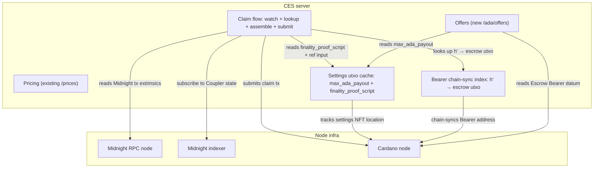
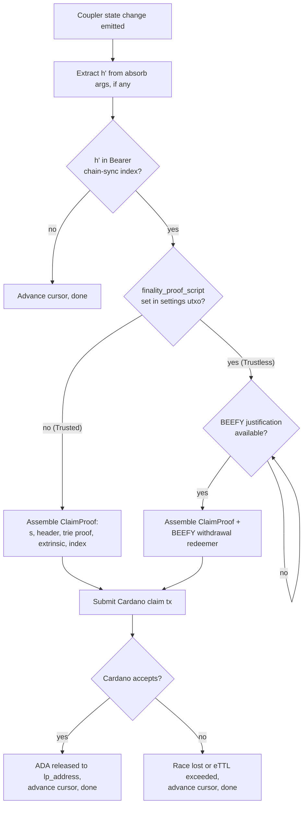

# LP infrastructure

The LP-side server that liquidity providers run. The existing CES server plus a new `/ada/offers` endpoint plus a claim flow that watches the **Coupler** on Midnight and submits claim txs to the **Escrow Bearer** on Cardano.

## Responsibilities

The CES server:

1. **Issues** signed quote tokens via the existing `/prices` endpoint
2. **Receives** `POST /ada/offers` calls from **Users** with an escrow utxo reference, the **Coupler** address, and quote token
3. **Verifies** the quote token's sig and expiry, reads the on-chain escrow utxo from Cardano, validates that the datum and locked ADA match the quoted terms, confirms confirmation depth, and reads the settings utxo to enforce the current `max_ada_payout` cap (see [VALIDATOR.md Settings utxo](VALIDATOR.md#settings-utxo))
4. **Builds** the LP-side capacity leg (`dust_input + absorb(h, h')`) and returns it as the `/ada/offers` response
5. **Chain-syncs** the **Escrow Bearer's** Cardano address, maintaining an in-memory index of escrow utxos filtered to `datum.lp_address == self` keyed by `datum.h_prime`
6. **Tracks** the settings utxo and caches the current `max_ada_payout` and `finality_proof_script` for offer verification and proof claim building (see [VALIDATOR.md Settings utxo](VALIDATOR.md#settings-utxo))
7. **Subscribes** to the **Coupler's** state via the Midnight indexer. On a state change, extracts `h'` from the `absorb` call's args and looks `h'` up in the index
8. **Assembles** the `ClaimProof` from the Midnight tx (`s`, header, trie proof, extrinsic bytes, extrinsic index). Under the Trustless release the **LP** also waits for the BEEFY justification and assembles a BEEFY proof script withdrawal alongside the claim
9. **Submits** the Cardano claim transaction

## CES components

`Cardano node` here can be a self-hosted node, Blockfrost, or any equivalent Cardano data source.

## `POST /ada/offers`

A new endpoint on the CES server. The **User** calls it after creating their Cardano escrow utxo. The endpoint returns the **LP's** capacity leg of the merged Midnight tx.

### Request body

| Field | Type | Notes |
|---|---|---|
| `quoteId` | `string` | The signed quote token issued earlier from `/prices`. Has a price quotes snapshot and an expiry. The CES server verifies the sig. Guarantees the **LP** won't change prices out from underneath the **User**. |
| `couplerContractAddress` | `string` | The **Coupler** address on Midnight that the **User** wants the **LP** to use. The CES server validates this is in its supported set (this allows us to version contracts). |
| `escrowUtxoRef` | `string` | The Cardano utxo reference for the escrow the **User** created. The CES server reads and validates the datum details. |

### Response body

On success:

| Field | Type | Notes |
|---|---|---|
| `unbalancedTx` | `string` | The **LP's** capacity leg of the (eventually) merged Midnight tx |
| `expiresAt` | `string`| Soft expiry, after which the **LP's** `dust_input` may no longer be valid. The **User** should sign and submit before this. Tracks `mTTL`. |

### Failure statuses

| Status | Reasons |
|---|---|
| `400` | Malformed request, missing fields, bad utxo reference, invalid quote token signature |
| `404` | No escrow utxo at the provided reference |
| `409` | Conflict with current on-chain state: escrow datum does not match the quote, insufficient Cardano confirmations, or unsupported contract address (**Bearer** or **Coupler** not in the **LP's** supported set) |
| `410` | Quote token expired |
| `503` | **LP** capacity unavailable (no DUST or wallet syncing) |

### Verification

When the CES server receives a `POST /ada/offers` call, the handler:

1. **Verifies** the `quoteId` HMAC signature against the **LP's** own secret. Rejects on mismatch.
2. **Decodes** the quote payload, checks `exp`, rejects if expired.
3. **Resolves** the Cardano utxo at `escrowUtxoRef`. Rejects if not found.
4. **Reads** the escrow's datum and locked lovelace value from Cardano.
5. **Compares** the datum and locked value to the quote payload, requiring at minimum:
   - `datum.lp_address == self`
   - Locked lovelace at the utxo `>= quote.prices.ada.lovelace` (over-funding allowed)
   - `datum.eTTL` satisfies the **LP's** policy (enough headroom for `mTTL` plus, under the Trustless release, BEEFY commitment lag, plus Cardano settlement plus safety)
6. **Verifies** the contract addresses, both must be in the **LP's** supported sets:
   - The **Bearer** address must be in `supportedCardanoValidators`
   - The **Coupler** address must be in `supportedMidnightContracts`
7. **Confirms** the utxo has at least `confirmationDepth` Cardano confirmations (LP-configurable).
8. **Reads** the settings utxo and rejects the offer if the escrow's locked lovelace exceeds the current `max_ada_payout`. This off-chain check stops the **LP** from spending DUST on a capacity leg that won't claim.
9. **Builds** the **LP** capacity leg containing a DUST input plus an `absorb(datum.h, datum.h_prime)` circuit call against the request's `couplerContractAddress`.
10. **Returns** the unbalanced tx bytes plus `expiresAt`.

### Idempotency

Same `(quoteId, escrowUtxoRef)` pair is safe to retry. The handler reuses the existing CES offer cache: an LRU on built offers, an in-flight map for coalescing concurrent calls, and a DUST utxo lock that reserves the input until the offer expires.

## Bearer chain-sync index

The CES server runs a Cardano chain-sync subscription on the **Escrow Bearer's** address. It maintains an in-memory index of currently-unclaimed escrows where `datum.lp_address == self`, keyed by `datum.h_prime`. Each entry holds the Cardano-side details (datum fields, utxo reference, locked lovelace) needed to assemble a claim tx.

## Settings utxo tracking

The CES server subscribes to the settings utxo NFT. When CES detects the NFT has moved, it fetches the new utxo's datum and updates an in-memory cache of `max_ada_payout` and `finality_proof_script`. See [VALIDATOR.md Settings utxo](VALIDATOR.md#settings-utxo).

The cache is read at three points:

- `/ada/offers` verification reads `max_ada_payout` to reject offers whose escrow is greater than the cap.
- Proof claim building reads `finality_proof_script` to decide whether to create a BEEFY proof script withdrawal alongside the `ClaimProof`.
- Proof claim tx building includes the current settings utxo as a reference input (required by the **Bearer**).

**Reactivity:**

- A `max_ada_payout` decrease takes effect immediately for new `/ada/offers` calls. In-flight offers can no longer be claimed if the escrow's locked lovelace exceeds the new cap, so the LP eats the DUST opportunity cost on those.
- A `finality_proof_script` flip changes the required claim tx shape. Any claim tx already in the mempool but not yet on-chain at the moment of the flip will fail the V7 validator check.

## Claim flow

Once a **User** submits a merged Midnight tx that lands, the **Coupler** contract emits a state change. The **Coupler** emits one state change per contract-calling tx, so most events the CES sees won't be from this LP's offers. CES extracts `h'` from the `absorb` args, looks it up in the Bearer chain-sync index, and on a hit assembles and submits a claim tx. The structure is the same when we move from the Trusted phase to the Trustless phase, only the surrounding tx differs by whether `settings.finality_proof_script` is set.

- **Extract:** most events aren't absorbs. If there's nothing to extract advance the cursor.
- **Lookup:** most absorbs are for other **LPs** or unrelated escrows. If `h'` isn't in the index, advance the cursor.
- **Phase:** under the Trusted release (`settings.finality_proof_script = None`), submit immediately. Under the Trustless release, wait for the BEEFY justification before assembling.
- **Assemble:** under the Trusted release, build the `ClaimProof` from indexer data. Under the Trustless release, also assemble the BEEFY proof script's withdrawal redeemer (carrying the same `header_bytes` as the `ClaimProof` plus the `beefy_proof`).
- **Submit:** under the Trusted release, the claim tx references the settings utxo. Under the Trustless release, it additionally includes the BEEFY withdrawal entry and reference inputs for `committee_bridge` and `beefy_signer_threshold`.
- **Confirm:** the claim should be accepted. If it's not, the escrow was already consumed or `eTTL` has passed.

## Restart and recovery

The CES server persists two cursors: the **last-processed Midnight block height** for the Coupler subscription and the **last-processed Cardano block height** for the Bearer chain-sync. On startup, it resumes both subscriptions from those cursors. The chain-sync rebuilds the in-memory `h'` index from the persisted state plus any blocks since and the indexer replays missed Coupler events. The cursors advance after each event is processed.

The settings utxo cache is rebuilt on startup by looking up the current location of the settings NFT via its asset class.
