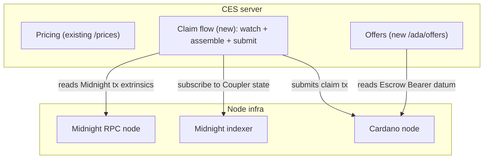
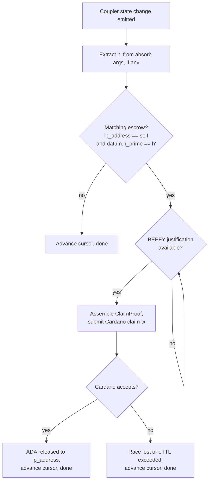

# LP infrastructure

The LP-side server that liquidity providers run. The existing CES server plus a new `/ada/offers` endpoint plus a claim flow that watches the **Coupler** on Midnight and submits claim txs to the **Escrow Bearer** on Cardano.

## Responsibilities

The CES server:

1. **Issues** signed quote tokens via the existing `/prices` endpoint
2. **Receives** `POST /ada/offers` calls from **Users** with an escrow utxo reference, the **Coupler** address, and quote token
3. **Verifies** the quote token's sig and expiry, reads the on-chain escrow utxo from Cardano, validates that the datum and locked ADA match the quoted terms, and confirms confirmation depth
4. **Builds** the LP-side capacity leg (`dust_input + absorb(h, h')`) and returns it as the `/ada/offers` response
5. **Subscribes** to the **Coupler's** state via the Midnight indexer. On a state change, queries the **Bearer** for datums with `datum.lp_address == self` and `datum.h_prime` matching the `absorb` call's second argument
6. **Assembles** the BEEFY finality proof once the merged tx is detected as finalized
7. **Submits** the Cardano claim transaction

## CES components

`Cardano node` here can be a self-hosted node, Blockfrost, or any equivalent Cardano data source.

## `POST /ada/offers`

A new endpoint on the CES server. The **User** calls it after creating their Cardano escrow utxo. The endpoint returns the **LP's** capacity leg of the merged Midnight tx.

### Request body

| Field | Type | Notes |
|---|---|---|
| `quoteId` | `string` | The signed quote token issued earlier from `/prices`. Has a price quotes snapshot and an expiry. The CES server verifies the sig. Guarantees the **LP** won't change prices out from underneath the **User**. |
| `couplerContractAddress` | `string` | The **Coupler** address on Midnight that the **User** wants the **LP** to use. The CES server validates this is in its supported set (this allows us to version contracts). |
| `escrowUtxoRef` | `string` | The Cardano utxo reference for the escrow the **User** created. The CES server reads and validates the datum details. |

### Response body

On success:

| Field | Type | Notes |
|---|---|---|
| `unbalancedTx` | `string` | The **LP's** capacity leg of the (eventually) merged Midnight tx |
| `expiresAt` | `string`| Soft expiry, after which the **LP's** `dust_input` may no longer be valid. The **User** should sign and submit before this. Tracks `mTTL`. |

### Failure statuses

| Status | Reasons |
|---|---|
| `400` | Malformed request, missing fields, bad utxo reference, invalid quote token signature |
| `404` | No escrow utxo at the provided reference |
| `409` | Conflict with current on-chain state: escrow datum does not match the quote, insufficient Cardano confirmations, or unsupported contract address (**Bearer** or **Coupler** not in the **LP's** supported set) |
| `410` | Quote token expired |
| `503` | **LP** capacity unavailable (no DUST or wallet syncing) |

### Verification

When the CES server receives a `POST /ada/offers` call, the handler:

1. **Verifies** the `quoteId` HMAC signature against the **LP's** own secret. Rejects on mismatch.
2. **Decodes** the quote payload, checks `exp`, rejects if expired.
3. **Resolves** the Cardano utxo at `escrowUtxoRef`. Rejects if not found.
4. **Reads** the escrow's datum and locked lovelace value from Cardano.
5. **Compares** the datum and locked value to the quote payload, requiring at minimum:
   - `datum.lp_address == self`
   - Locked lovelace at the utxo `>= quote.prices.ada.lovelace` (over-funding allowed)
   - `datum.eTTL` satisfies the **LP's** policy (enough headroom for `mTTL` plus BEEFY commitment lag plus Cardano settlement plus safety)
6. **Verifies** the contract addresses, both must be in the **LP's** supported sets:
   - The **Bearer** address must be in `supportedCardanoValidators`
   - The **Coupler** address must be in `supportedMidnightContracts`
7. **Confirms** the utxo has at least `confirmationDepth` Cardano confirmations (LP-configurable).
8. **Builds** the **LP** capacity leg containing a DUST input plus an `absorb(datum.h, datum.h_prime)` circuit call against the request's `couplerContractAddress`.
9. **Returns** the unbalanced tx bytes plus `expiresAt`.

### Idempotency

Same `(quoteId, escrowUtxoRef)` pair is safe to retry. The handler reuses the existing CES offer cache: an LRU on built offers, an in-flight map for coalescing concurrent calls, and a DUST utxo lock that reserves the input until the offer expires.

## Claim flow

Once a **User** submits a merged Midnight tx, the **Coupler** contract emits a state change. The CES server listens and asks Cardano for a matching escrow, then assembles a BEEFY proof, and submits the claim tx.

- **Extract:** most events aren't absorbs. If there's nothing to extract  advance the cursor
- **Match:** most absorbs are for other **LPs**. If there's no match advance the cursor
- **Wait:** BEEFY justification isn't always ready so retry until it is
- **Submit:** bundle the proof into a `ClaimProof` redeemer and submit the Cardano claim tx
- **Confirm:** the claim should be accepted. If it's not, the escrow was already consumed or `eTTL` has passed

## Restart and recovery

The CES server persists one piece of state, the **last-processed Midnight block height**. On startup, it subscribes to the **Coupler's** state observable starting at that height. The indexer replays everything missed, and each event runs through the normal flow. The cursor advances after each event is processed.
