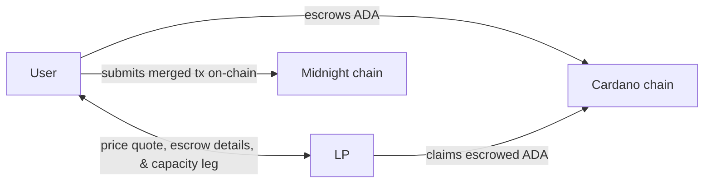
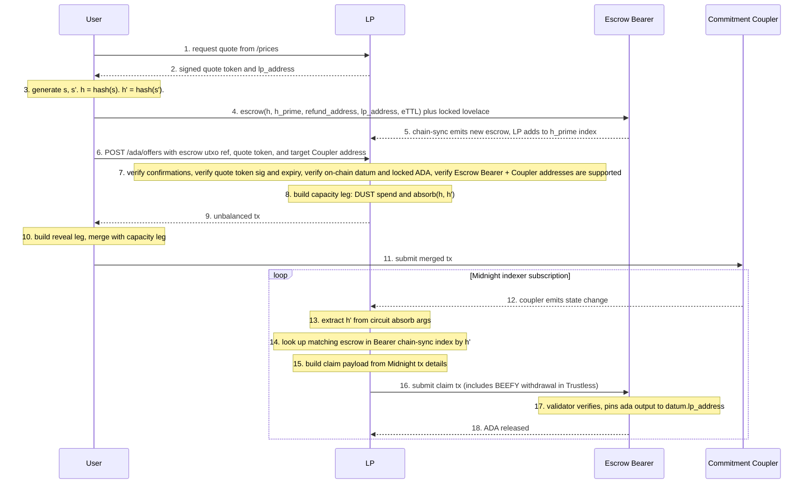
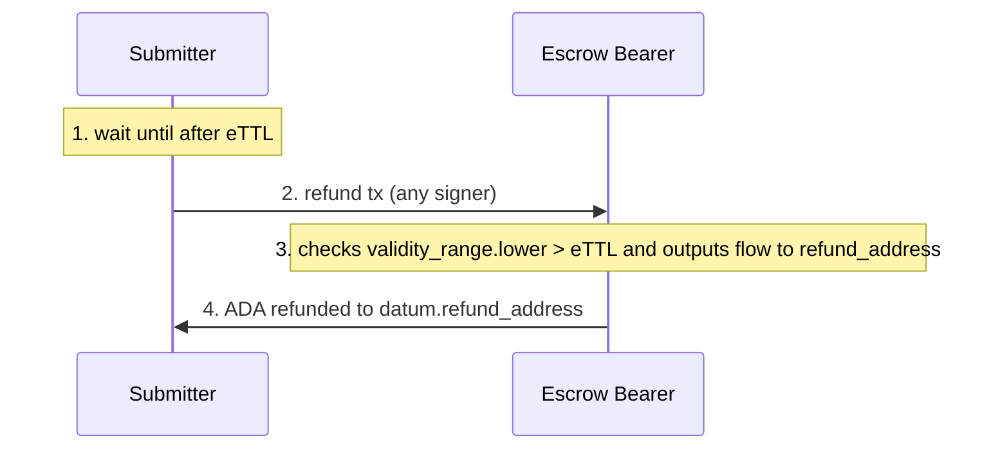

# Overview

## Problem

A **User** holds ADA on Cardano, wants to submit some Midnight operation / tx, but doesn't have the required DUST. A **Liquidity Provider (LP)** with DUST accepts ADA as payment for funding the **User's** Midnight tx. The **LP** retrieves the **User's** escrowed ADA payment on Cardano once the DUST-funded Midnight tx finalizes.

## A high-level view

### Component diagram and flow

- **User:** Holds ADA on Cardano. They want to submit some Midnight tx, which requires DUST for gas, but they have no DUST. The **User**:
  1. **Picks** an **LP** from the registry (out of scope, already exists), requests a price quote, and receives an **LP**-signed quote token
  2. **Generates** some secrets (see [SDK.md](SDK.md#responsibilities)) and submits a Cardano tx to escrow their ADA payment
  3. **Receives** an unbalanced tx from the **LP** (the "capacity leg"), which they balance (with their "reveal leg")
  4. **Submits** the tx to Midnight, which merges their operation and the two legs
- **LP:** Holds DUST on Midnight. The **LP** will exchange DUST on Midnight for ADA on Cardano. The **LP**:
  1. **Issues** a signed quote token
  2. **Verifies** a quote token and escrow details
  3. **Provides** the capacity leg of the Midnight tx to the **User**
  4. **Listens** to Midnight for the **User's** merged tx to finalize
  5. **Submits** a tx to claim the escrowed ADA on Cardano
- **Cardano:** Has the **Escrow Bearer** (claim / refund validator)
- **Midnight:** Has the **Commitment Coupler** (the mint+reveal / absorb circuits)

## Guarantees

The protocol ships in two phases: a **Trusted** release and a **Trustless** release. Both share the same weak guarantee. The hard guarantee strengthens from Trusted to Trustless. See [VALIDATOR.md](VALIDATOR.md#phases) for how the transition between phases happens on-chain.

**Both releases: Weak guarantee:** the **User** may rarely have their Midnight op DUST-funded by the **LP** without the **User** paying ADA. We tolerate this rare case (in which the **LP** isn't compensated) because DUST regenerates.

### Trusted release

**Hard guarantee:** the **LP** can claim the ADA ***iff*** they *learned* `s`. This could happen as early as the **LP** viewing the **User's** tx in the Midnight mempool and this is why it's "Trusted" (we trust that **LPs** will behave appropriately). Safeguards (`max_ada_payout` cap, kill switch ability, Midnight Foundation refund budget) bound the risk of bad **LPs**. See [VALIDATOR.md](VALIDATOR.md#operational-safeguards) for the attack surface and the safeguard mechanics.

### Trustless release

**Hard guarantee:** the **LP** can claim the ADA ***iff*** the **User's** intended Midnight op has *finalized*. In this release the **Escrow Bearer** specifies a separate "BEEFY" proof script (via `settings.finality_proof_script`) that verifies finalization via BEEFY signatures and MMR inclusion and we don't need to trust that **LPs** behave correctly.

We'll still retain the `max_ada_payout` settings utxo parameter for safety controls.

## Some crypto to note

The **User** generates two secrets: public `s` and private `s'`, and their hashes, `h` and `h'`, are stored in the **Escrow Bearer's** datum.

Within the flow, `s` is disclosed when the **User** calls `mintReveal(disclose(s), witness(s'))`.

`s` is what gates the **LP's** ability to claim the Cardano-escrowed ADA. The **Escrow Bearer** checks `hash(s) == datum.h`, which means the **LP** can only claim if they learned `s`.

`s'`, however, is never revealed.

`s'` prevents the **LP** from front-running the **User's** tx. Without `s'` (equivalently, if `mintReveal` only took `s`), the **LP** could read `s` from the mempool, "spoof" the **User**, and call `mintReveal`, getting their own tx on-chain, censoring the **User**, and claiming the escrowed ADA.

## Possible outcomes

| Outcome | Possible | Defense |
|---|---|---|
| **User** gets DUST and final Midnight op, **LP** gets ADA | Yes | happy path |
| **User** gets ADA back, **LP** loses nothing | Yes | refund path is always available after `eTTL` (**LP** DUST input expired at `mTTL`) |
| **User** gets DUST and final Midnight op, **LP** gets nothing | Yes (rare) | no defense, it's a race between `eTTL` and the **LP's** claim, **LP** eats the opportunity cost (/ raises prices to compensate) |
| **LP** gets ADA and **User** gets nothing | - Trusted release: Yes (bounded by safeguards) - Trustless release: No | See [VALIDATOR.md](VALIDATOR.md#operational-safeguards) for Trusted release safeguards. |

## Two valid paths

- **Happy path:** The **User's** Midnight op finalizes and the **LP** receives the **User's** escrowed ADA
- **Refund path:** The **User** retrieves their escrowed ADA after a timeout.

### The Happy Path sequence

The flow threads four legs across **User**, **LP**, Cardano, and Midnight. Each leg below points to its detail home.

1. **Discovery and quote** (diagram steps 0-3). **LP** runs a background chain-sync subscription on the **Bearer's** address. **User** picks an **LP** from the CES registry, hits `/prices`, gets a signed quote token plus `lp_address`, and generates `s` and `s'`. See [SDK Responsibilities](SDK.md#responsibilities), [LP_INFRA Responsibilities](LP_INFRA.md#responsibilities), [Bearer chain-sync index](LP_INFRA.md#bearer-chain-sync-index).
2. **Escrow and offer** (diagram steps 4-9). **User** locks the quoted lovelace at the **Bearer's** address with datum `{ h, h_prime, refund_address, lp_address, eTTL }`. **LP's** chain-sync indexes the new escrow by `h_prime`. **User** calls `POST /ada/offers`, **LP** verifies and returns the capacity leg (`dust_input + absorb(h, h')`). See [VALIDATOR Datum](VALIDATOR.md#datum), [LP_INFRA /ada/offers](LP_INFRA.md#post-adaoffers).
3. **Merge and submit on Midnight** (diagram steps 10-11). **User** builds the reveal leg (`mintReveal(disclose(s), witness(s'))` plus `user_op`), merges with the capacity leg, signs, and submits to Midnight. `s` becomes public in the extrinsic call data. See [SDK Responsibilities](SDK.md#responsibilities), [COMPACT](COMPACT.md).
4. **Claim on Cardano** (diagram steps 12-18). The **Coupler** emits a state change for the `absorb` call. **LP** extracts `h'`, looks up the matching escrow in its index, assembles the `ClaimProof`, and submits the claim tx (with a BEEFY proof script withdrawal in the Trustless release). The **Bearer** runs V1-V7 and releases ADA to `datum.lp_address`. See [LP_INFRA Claim flow](LP_INFRA.md#claim-flow), [VALIDATOR Claim path](VALIDATOR.md#claim-path), [VALIDATOR Verification](VALIDATOR.md#verification).

### The refund path

1. **Wait until after `eTTL`.** The refund path is only valid after the deadline in the escrow datum
2. **Submitter → Bearer: submit refund tx.** Any party can consume the escrow utxo on the refund path (no signature requirement)
3. **Bearer verifies refund.** The **Bearer** checks that the tx's validity range starts after `datum.eTTL` and that the locked lovelace (minus fees) flows to `datum.refund_address`
4. **Bearer → refund_address: refund ADA.** ADA settles to `datum.refund_address`

## Some timing constraints

- `eTTL > mTTL` by enough margin to cover worst-case BEEFY commitment lag + Cardano settlement + a safety buffer
- **LP's** `dust_input` validity window expires at `mTTL`
- Cardano claim path closes at `eTTL`. After `eTTL` only the **User's** refund path is valid

## The component-specific docs

- [VALIDATOR.md](VALIDATOR.md): the Cardano-side validator (the **Escrow Bearer**), datum and redeemer schema, claim and refund tx shapes, claim-path verification steps
- [SDK.md](SDK.md): the user-side library with secret generation, escrow and refund handling, and merged-tx Midnight submission
- [LP_INFRA.md](LP_INFRA.md): the LP-side server, the new `POST /ada/offers` endpoint, escrow verification steps
- [COMPACT.md](COMPACT.md): the Midnight-side contract (the **Commitment Coupler**) and its two circuits for balancing a commit-reveal scheme

