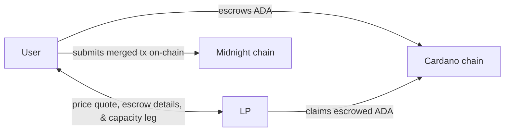
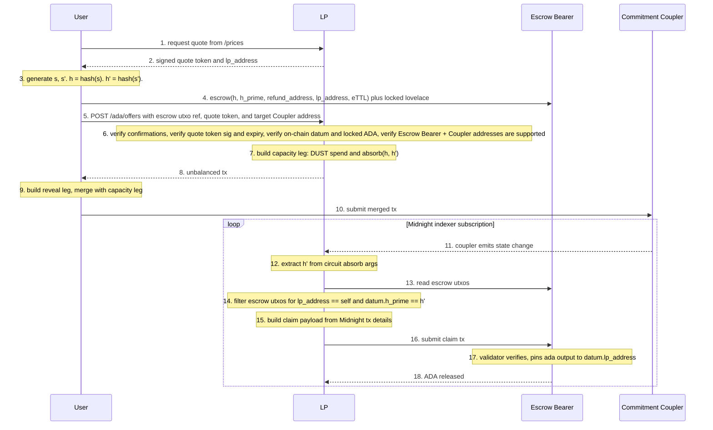
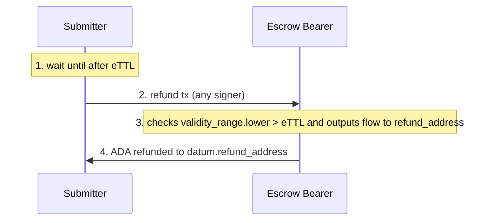

# Overview

## Problem

A **User** holds ADA on Cardano, wants to submit some Midnight operation / tx, but doesn't have the required DUST. A **Liquidity Provider (LP)** with DUST accepts ADA as payment for funding the **User's** Midnight tx. The **LP** retrieves the **User's** escrowed ADA payment on Cardano once the DUST-funded Midnight tx finalizes.

## A high-level view

### Component diagram and flow

- **User:** Holds ADA on Cardano. They want to submit some Midnight tx, which requires DUST for gas, but they have no DUST. The **User**:
  1. **Picks** an **LP** from the registry (out of scope, already exists), requests a price quote, and receives an **LP**-signed quote token
  2. **Generates** some secrets (detailed later) and submits a Cardano tx to escrow their ADA payment
  3. **Receives** an unbalanced tx from the **LP** (the "capacity leg"), which they balance (with their "reveal leg")
  4. **Submits** the merged tx to Midnight
- **LP:** Holds DUST on Midnight. The **LP** will exchange DUST on Midnight for ADA on Cardano. The **LP**:
  1. **Issues** a signed quote token
  2. **Verifies** a quote token and escrow details
  3. **Provides** the capacity leg of the Midnight tx to the **User**
  4. **Listens** to Midnight for the **User's** merged tx to finalize
  5. **Submits** a tx to claim the escrowed ADA on Cardano
- **Cardano:** Has the **Escrow Bearer** (claim / refund validator)
- **Midnight:** Has the **Commitment Coupler** (the mint+reveal / absorb circuits)

## Some guarantees

**Hard guarantee:** the **LP** can claim the ADA ***iff*** the **User's** intended Midnight operation has finalized.

**Weak guarantee:** the **User** may rarely have their Midnight op DUST-funded by the **LP** without paying ADA. We tolerate this rare case (in which the **LP** isn't compensated) because DUST regenerates.

## Some crypto to note

The **User** generates two secrets: public `s` and private `s'`, and their hashes, `h` and `h'`, are stored in the **Escrow Bearer's** datum.

Within the flow, `s` is disclosed when the **User** calls `mintReveal(disclose(s), witness(s'))`.

`s` prevents the **LP** from claiming the Cardano-escrowed ADA without some block finalized on Midnight (because the **Escrow Bearer** validates the finalization of the Midnight block containing `s`, this is the BEEFY protocol, more on this later).

`s'`, however, is never revealed.

`s'` prevents the **LP** from front-running the **User's** tx. Without `s'` (equivalently, if `mintReveal` only took `s`), the **LP** could read `s` from the mempool, "spoof" the **User**, and call `mintReveal`, getting their own tx on-chain, censoring the **User**, and claiming the escrowed ADA.

## Possible outcomes ?

| Outcome | Possible | Defense |
|---|---|---|
| **User** gets DUST and final Midnight op, **LP** gets ADA | Yes | happy path |
| **User** gets ADA back, **LP** loses nothing | Yes | refund path (**LP** DUST input expired at `mTTL`) |
| **User** gets DUST and final Midnight op, **LP** gets nothing | Yes (rare) | no defense, it's a race between `eTTL` and the **LP's** claim, **LP** eats the opportunity cost |
| **User** loses ADA and gets nothing | **No** | refund path always available after `eTTL` and only to the **User** |
| **LP** gets ADA and **User** gets nothing | **No** | **LP** can't claim without proving **User's** final Midnight op |

## Two valid paths

- **Happy path:** The **User's** Midnight op finalizes and the **LP** receives the **User's** escrowed ADA
- **Refund path:** The **User** retrieves their escrowed ADA after a timeout. This is what makes the weak guarantee "weak": if timing lines up, the **User** refunds their ADA *and* gets their DUST-funded tx on Midnight.

## The Happy Path sequence

1. **User → LP: request quote.** **User** hits the **LP's** `/prices` endpoint
2. **LP → User: send signed quote token.** **LP** returns quotes, a signed quote token, and `lp_address` on Cardano
3. **User generates secrets.** **User** generates two secrets, `s` and `s'`, and computes `h = hash(s)` and `h' = hash(s')`.
4. **User → Bearer: escrow ADA.** **User** submits a Cardano tx that locks the quoted lovelace at the **Bearer's** address with datum `{ h, h_prime, refund_address, lp_address, eTTL }`.
5. **User → LP: POST /ada/offers.** **User** calls the **LP's** `/ada/offers` endpoint with the escrow's utxo reference, the quote token, and the target **Coupler** address on Midnight.
6. **LP verifies preconditions.** **LP** verifies the quote token, the number of confirmations on the escrow utxo, the datum details of the escrow utxo, and the **Bearer** address.
7. **LP builds capacity leg.** **LP** builds an unbalanced Midnight tx (the capacity leg) containing a DUST spend and an `absorb(h, h')` circuit call
8. **LP → User: return capacity leg.** **LP** returns the capacity leg to the **User** as the `/ada/offers` response
9. **User builds reveal leg and merges.** **User** builds the reveal leg with `mintReveal(disclose(s), witness(s'))` (balancing **LP's** `absorb`) and their `user_op`. The **User** merges the **LP's** capacity leg with their reveal leg, producing a balanced Midnight tx.
10. **User → Midnight: submit merged tx.** **User** signs the merged transaction and submits it to Midnight. Midnight processes it and `s` is now public in the extrinsic call data on a finalized block.
11. **Coupler → LP: emit state change.** **LP** keeps an ongoing subscription to the **Coupler's** state via the Midnight indexer. Each tx that calls the **Coupler** emits a state change.
12. **LP extracts h' from circuit absorb args.** **LP** reads the `absorb` call's `h'` argument from the emitted state change.
13. **LP → Bearer: read escrow utxos.** **LP** queries the **Bearer** for utxos
14. **LP filters escrow utxos.** **LP** filters the escrow utxos whose `datum.lp_address` equals self and `datum.h_prime` equals `h'`
15. **LP builds claim payload.** **LP** fetches the finalized Midnight block and builds the claim payload with BEEFY proof details
16. **LP → Bearer: submit claim tx.** **LP** submits a Cardano tx that consumes the escrow utxo, supplying `s` and the finality proof in the redeemer
17. **Bearer verifies.** The **Bearer** verifies (BEEFY signature, header decode, trie inclusion, hash checks, etc.)
18. **Bearer → LP: release ADA.** ADA settles to the **LP's** address

## The refund path

1. **Wait until after `eTTL`.** The refund path is only valid after the deadline in the escrow datum
2. **Submitter → Bearer: submit refund tx.** Any party can consume the escrow utxo on the refund path (no signature requirement)
3. **Bearer verifies refund.** The **Bearer** checks that the tx's validity range starts after `datum.eTTL` and that the locked lovelace (minus fees) flows to `datum.refund_address`
4. **Bearer → refund_address: refund ADA.** ADA settles to `datum.refund_address`

## Some timing constraints

- `eTTL > mTTL` by enough margin to cover worst-case BEEFY commitment lag + Cardano settlement + a safety buffer
- **LP's** `dust_input` validity window expires at `mTTL`
- Cardano claim path closes at `eTTL`. After `eTTL` only the **User's** refund path is valid

## The component-specific docs

- [SDK.md](SDK.md): the user-side library with secret generation, escrow and refund handling, and merged-tx Midnight submission
- [VALIDATOR.md](VALIDATOR.md): the Cardano-side validator (the **Escrow Bearer**), datum and redeemer schema, claim and refund tx shapes, claim-path verification steps
- [LP_INFRA.md](LP_INFRA.md): the LP-side server, the new `POST /ada/offers` endpoint, escrow verification steps
- [COMPACT.md](COMPACT.md): the Midnight-side contract (the **Commitment Coupler**) and its two circuits for balancing a commit-reveal scheme

