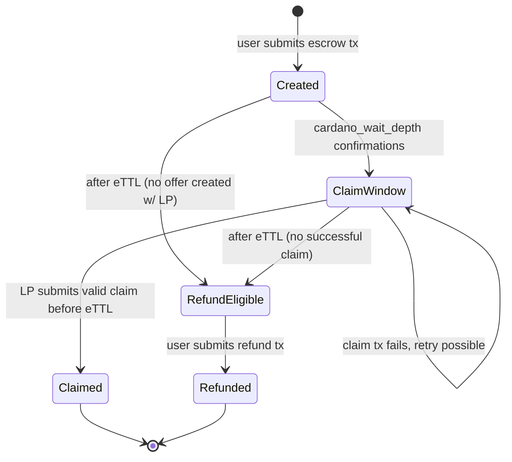

# Escrow bearer

The **Escrow Bearer** is the Cardano-side validator that locks the **User's** ADA into an escrow utxo. It releases funds to the **LP** via the claim path when the **LP** provides a proof of the merged Midnight tx's finalization, or returns the ADA to the **User** via the refund path after `eTTL`.

## Lifecycle



`ClaimWindow` and `RefundEligible` are user-facing *windows* describing which path is available, not literal on-chain states. The escrow utxo only transitions on consumption (claim or refund). All other transitions are time- and policy-driven off-chain conditions.

- `Created` → `ClaimWindow`: off-chain, the **LP** determines this based on `confirmations >= cardano_wait_depth` AND current time `< eTTL`
- `Created` → `RefundEligible`: time-based, `eTTL` passes before the **LP** opens a claim window (e.g., the **User** never submitted `/ada/offers`)
- `ClaimWindow` → `Claimed`: requires full claim verification (see [claim path](#claim-path) below)
- `ClaimWindow` → `ClaimWindow`: claim is permissionless, race-lost or malformed claim txs leave the escrow live until `eTTL`
- `ClaimWindow` → `RefundEligible`: time-based, `eTTL` passes without a successful claim landing
- `RefundEligible` → `Refunded`: signed by `datum.user_signing_key` (see [refund path](#refund-path) below)

## Datum

The **User** creates the datum attached to the utxo at the **Escrow Bearer's** address.

| Field | Type | Notes |
|---|---|---|
| `h` | `Bytes32` | `hash(s)`, public commitment of secret that will be made public |
| `h'` | `Bytes32` | `hash(s')`, public commitment of secret that stays private |
| `user_signing_key` | `KeyHash` | used to auth'n the refund |
| `lp_address` | `Address` | where the escrowed ADA will be sent on claim |
| `amount_ada` | `u64` | how much ADA (in lovelace) is escrowed and will be claimed (or refunded) |
| `eTTL` | `u64` | Cardano deadline before which the ADA must be claimed, after which it can be refunded |


## Redeemer

The **Escrow Bearer's** redeemer is one of two variants:

```aiken
pub type Action {
  Claim(ClaimProof)
  Refund
}
```

`Claim` carries data assembled by the **LP** from the **User's** finalized Midnight tx; the validator uses it to prove the claim is valid. `Refund` has no fields, it relies on the signer and validity range present in the tx.

## Claim path

When the **LP** spends the escrow utxo via the claim path, the Cardano tx has the shape:

| Field | Required content |
|---|---|
| **Inputs** | The escrow utxo being claimed |
| **Reference inputs** | The current `committee_bridge` and `beefy_signer_threshold` NFT utxos, these are used in validation |
| **Outputs** | At least one output sending `datum.amount_ada` lovelace to `datum.lp_address` |
| **Redeemer** | The `Claim(ClaimProof)` variant |
| **Validity range** | `upper_bound < datum.eTTL` |
| **Required signers** | None. Anyone can run the claim; the escrowed ADA can only be sent to the **LP's** address. |

### `ClaimProof` redeemer fields

| Field | Type | Notes |
|---|---|---|
| `s` | `Bytes` (32 bytes) | The validator uses `s` (in conjunction with finalization) to verify that some tx related to the **User's** datum has finalized on Midnight. The validator hashes `s` and compares the result against `datum.h`. |
| `beefy_proof` | `BeefyConsensusProof` | The BEEFY finality proof produced by Midnight validators. The **LP** discovers the BEEFY justification via the Midnight node. The validator verifies the signature quorum against the on-chain authority set provided in the reference inputs. |
| `header_bytes` | `Bytes` | The Midnight block header for the block containing the **User's** finalized tx. Used to verify finalization. |
| `trie_proof` | `List<Bytes>` | List of Patricia tries required to verify finalization. |
| `extrinsic_bytes` | `Bytes` | Raw bytes of the finalized merged transaction (the **User's** reveal leg and the **LP's** capacity leg). The validator uses this to verify finalization. |
| `extrinsic_index` | `Int` | Metadata for finalization verification. |

### Claim-path verification

The **Escrow Bearer** runs each check; failure at any step rejects the claim tx.

| # | Step | Where it lives |
|---|---|---|
| 1 | Read the trusted authority set and threshold from `committee_bridge` and `beefy_signer_threshold` NFTs given by reference inputs | reserve-contracts |
| 2 | Verify signed BEEFY commitment against authority set | reserve-contracts (`verify_consensus`) |
| 3 | Extract MMR root from the target block header's `BEEF` consensus digest (`ConsensusLog::MmrRoot`) | claim Aiken module (to be built) |
| 4 | Verify MMR inclusion of target block leaf in MMR root | reserve-contracts (`verify_mmr_update_proof`) |
| 5 | Verify supplied header bytes hash (Blake2b256) to MMR leaf's `parent_hash` | inline (single hash call) |
| 6 | SCALE-decode header, extract `extrinsics_root` | substrate-trie Aiken module (to be built) |
| 7 | Verify extrinsic inclusion in `extrinsics_root` via Patricia trie proof | substrate-trie Aiken module (to be built) |
| 8 | Sanity-check ledger-version prefix | trivial byte compare |
| 9 | Byte-extract `s`, `h`, `h'` at hardcoded offsets, check `hash(s)==datum.h`, abs[0]==datum.h, abs[1]==datum.h' | claim Aiken modules (to be built) |
| 10 | Pin `datum.amount_ada` to `datum.lp_address`, require `validity_range.upper < datum.eTTL` | inline |

## Refund path

When the **User** spends an escrow utxo via the refund path, the Cardano transaction has this shape:

| Field | Required content |
|---|---|
| **Inputs** | The escrow utxo being refunded |
| **Reference inputs** | None |
| **Outputs** | Unconstrained, ADA goes wherever the **User's** signing key says |
| **Redeemer** | `Action::Refund` variant |
| **Validity range** | `lower_bound > datum.eTTL` |
| **Required signers** | `datum.user_signing_key` |

### Refund-path verification

| # | Check |
|---|---|
| 1 | The tx is signed by `datum.user_signing_key` |
| 2 | `validity_range.lower > datum.eTTL` |
