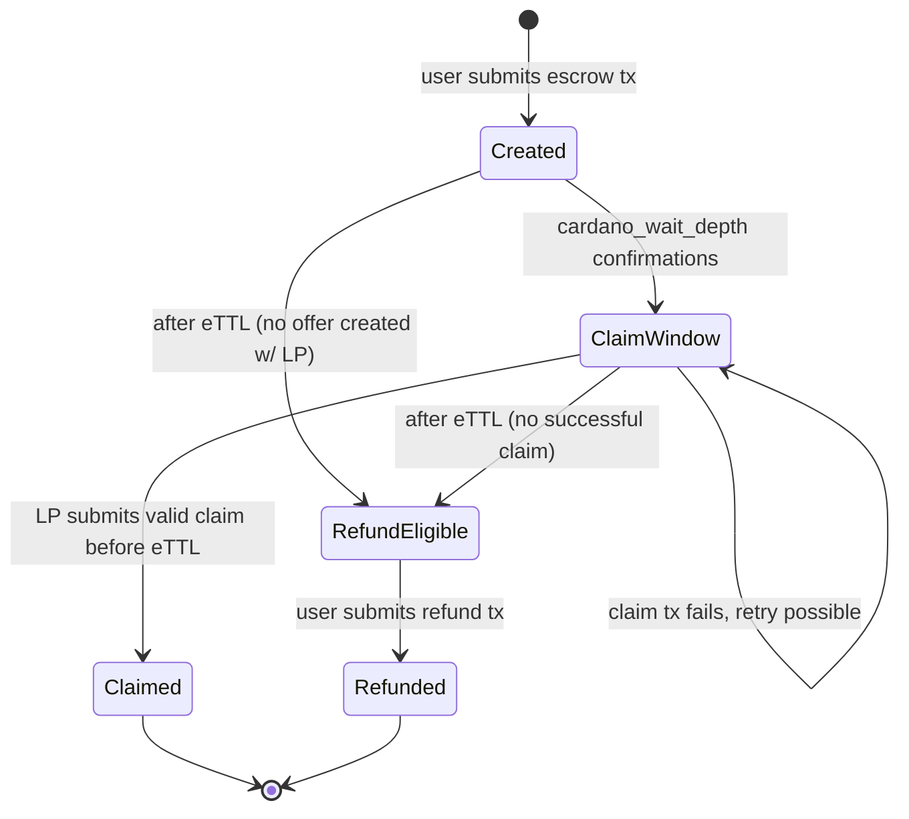

# Escrow bearer

The **Escrow Bearer** is the Cardano validator that locks the **User's** ADA into an escrow utxo. It releases funds to the **LP** via the claim path when the **LP** provides a valid `ClaimProof`, or returns the ADA to the **User** via the refund path after `eTTL`.

The **Escrow Bearer's**, default validation is "Vegetarian": it covers everything except BEEFY proving / Midnight finalization. A separate "BEEFY" proof script will be written later to verify finalization, and the **Escrow Bearer** will use the state of a settings utxo to check when the BEEFY validation should be enforced.

## Phases

The protocol ships in two phases, gated by the `finality_proof_script` field on the settings utxo.

| Phase | `settings.finality_proof_script` | What the **Escrow Bearer** requires of the claim tx | Hard guarantee |
|---|---|---|---|
| **Trusted release** | `None` | A `ClaimProof` redeemer and the standard checks (V1-V6 below) | The **LP** can claim iff they learned `s`. |
| **Trustless release** | `Some(BEEFY_script_hash)` | The Vegetarian checks, plus the BEEFY proof script must run and its `header_bytes` param must match the **Bearer's** `header_bytes` | The **LP** can claim iff the **User's** Midnight tx has finalized. |

Moving from the Trusted to Trustless phase happens by updating the settings utxo's datum. The **Escrow Bearer** itself is unchanged across phases, only its behavior changes based on the current `finality_proof_script` value.

**Phase-flip consequence.** When `finality_proof_script` flips from `None` to `Some`, all existing and new claims will require the BEEFY proof script's validation. For escrows that already exist, claiming **LPs** will have to supply a BEEFY proof after the flip. This should be simple for **LP's** to do and to determine, since we won't release the BEEFY validator until some time after BEEFY has landed on Midnight and is producing finalization proofs.

### Operational safeguards

The Trusted release's weaker guarantee leaves an attacks open for **LPs** against **Users**. We've got two operational levers to help:

- **`max_ada_payout` cap.** On the settings utxo datum, it bounds the max loss per claim. We set at deploy time and adjust it via the settings utxo's admin contract. See [Settings utxo](#settings-utxo) for the on-chain enforcement.
- **Midnight Foundation refund budget.** This is a reserve funded by Midnight Foundation to cover refunds if a **User** is harmed.

Both of these will remain available in the Trustless release but are expected to be exercised much less frequently once the BEEFY proof script proves finalization on-chain.

## Lifecycle



`ClaimWindow` and `RefundEligible` are windows describing which path is available, not literal on-chain states. The escrow utxo only transitions on consumption (claim or refund). All other transitions are time- and policy-driven off-chain conditions.

- `Created` → `ClaimWindow`: off-chain, the **LP** determines this based on `confirmations >= cardano_wait_depth` AND current time `< eTTL`
- `Created` → `RefundEligible`: time-based, `eTTL` passes before the **LP** opens a claim window (e.g., the **User** never submitted `/ada/offers`)
- `ClaimWindow` → `Claimed`: requires full claim verification (see [claim path](#claim-path) below)
- `ClaimWindow` → `ClaimWindow`: claim is permissionless, race-lost or malformed claim txs leave the escrow live until `eTTL`
- `ClaimWindow` → `RefundEligible`: time-based, `eTTL` passes without a successful claim landing
- `RefundEligible` → `Refunded`: ADA pinned to `datum.refund_address` (see [refund path](#refund-path) below)

## Datum

The **User** creates the datum attached to the utxo at the **Escrow Bearer's** address. See [OVERVIEW.md Some crypto to note](OVERVIEW.md#some-crypto-to-note) for the semantics of `s`, `s'`, `h`, `h'`.

| Field | Type | Notes |
|---|---|---|
| `h` | `Bytes32` | public commitment of `s` |
| `h_prime` | `Bytes32` | public commitment of `s'` |
| `refund_address` | `Address` | where the escrowed ADA returns on refund (any signer can submit) |
| `lp_address` | `Address` | where the escrowed ADA goes on claim |
| `eTTL` | `u64` | Cardano deadline before which the ADA must be claimed, after which it can be refunded |

Lovelace amount is the locked value at the utxo, not a datum field. Over-funding flows to the **LP** on claim.

## Settings utxo

A single settings utxo that we control parameterizes the **Escrow Bearer**. The validator reads it as a reference input for every claim.

| Field | Type | Notes |
|---|---|---|
| `max_ada_payout` | `u64` | Maximum lovelace a single claim may pay out to the **LP**. Setting this to `0` acts as a kill switch and rejects all claims. |
| `finality_proof_script` | `Option<ScriptHash>` | When `None`, the **Escrow Bearer** runs the Vegetarian verification (V1-V6). When `Some(script_hash)`, the **Bearer** additionally requires the tx to include a zero-value withdrawal entry for the script identified by `script_hash` and binds that withdrawal's redeemer to the **Bearer's** `header_bytes`. Setting this to `Some(BEEFY_script_hash)` is what transitions the system from the Trusted release to the Trustless release.

The settings utxo holds a one-shot NFT for discovery and lives at an address we control. The **SDK**, **LP**, and **Bearer** locate the settings utxo by querying by the NFT's id (we assume using Blockfrost). Updates spend the current settings utxo and produce a new one at the same address with the NFT transferred, so the asset ID is stable across updates.

The **Bearer** enforces both settings utxo fields on-chain: `max_ada_payout` via V1 and `finality_proof_script` via V7 (see [Verification](#verification)).

`max_ada_payout` is also pre-checked off-chain at two points to avoid building escrows and offers that V1 would reject:

- The **SDK** reads the settings utxo before the **User** locks ADA and refuses to create an escrow whose locked lovelace would exceed `max_ada_payout`. Saves the **User** from creating an escrow no **LP** will fulfill.
- The **LP** reads the settings utxo during `/ada/offers` verification and rejects any offer whose escrow exceeds `max_ada_payout`. Saves the **LP** from spending DUST on a capacity leg that won't claim.

## Refund path

The refund path is unaffected by the transition from Trusted to Trustless. When an escrow utxo is spent via the refund path, the Cardano transaction has this shape:

| Field | Required content |
|---|---|
| **Inputs** | The escrow utxo being refunded |
| **Reference inputs** | None |
| **Outputs** | Locked lovelace (minus fees) to `datum.refund_address` |
| **Redeemer** | `Refund` variant |
| **Validity range** | `lower_bound > datum.eTTL` |
| **Required signers** | None. Anyone can submit: the ADA only flows to `datum.refund_address`. |

### Refund-path verification

| # | Check |
|---|---|
| 1 | Locked lovelace (minus fees) goes to `datum.refund_address` |
| 2 | `validity_range.lower > datum.eTTL` |

## Claim path

The **LP** spends the escrow utxo by submitting a Cardano tx of this shape:

| Field | Required content |
|---|---|
| **Inputs** | The escrow utxo being claimed |
| **Reference inputs** | The settings utxo |
| **Withdrawals** | A zero-value entry for `settings.finality_proof_script`, present iff that field is `Some(_)` in the settings utxo datum |
| **Outputs** | Locked lovelace (minus fees) to `datum.lp_address` |
| **Redeemer** | `Claim(ClaimProof)` |
| **Validity range** | `upper_bound <= datum.eTTL` |
| **Required signers** | None. Anyone can run the claim, the escrowed ADA can only be sent to the **LP's** address. |

The **Escrow Bearer's** redeemer:

```aiken
pub type Action {
  Claim(ClaimProof)
  Refund
}
```

### `ClaimProof` fields

| Field | Type | Notes |
|---|---|---|
| `s` | `Bytes` | The validator hashes `s` and compares the result against `datum.h`. |
| `header_bytes` | `Bytes` | The Midnight block header the **LP** claims contains the **User's** tx. SCALE-decoded to extract `extrinsics_root`. Under the Trustless release, the **Bearer** also asserts the BEEFY proof script's redeemer carries the same `header_bytes`. |
| `trie_proof` | `List<Bytes>` | Patricia trie proof witnessing `extrinsic_bytes` is included in the trie under `extrinsics_root`. |
| `extrinsic_bytes` | `Bytes` | Raw bytes of the merged transaction (the **User's** Midnight op, their reveal leg, and the **LP's** capacity leg). |
| `extrinsic_index` | `Int` | Index of the extrinsic in the block's extrinsics trie. |

Under the Trusted release, the **Escrow Bearer** doesn't verify Midnight finalization. The `s` and absorb-args check still tie the claim to the **LP** having learned `s`, which means the **User** must have submitted a Midnight tx. What the validator can't tell is whether that tx finalized: it could be pre-finalization, orphaned by a reorg, or one of several conflicting txs in an **LP** double-spend. Under the Trustless release, the BEEFY proof script closes this gap (see below).

### Verification

The **Escrow Bearer** runs each check and failure at any step rejects the claim tx.

| # | Step | Where it lives |
|---|---|---|
| V1 | Read `max_ada_payout` from the settings utxo (reference input). Require locked lovelace (minus fees) `<= max_ada_payout` | claim Aiken module (to be built) |
| V2 | SCALE-decode `header_bytes`, extract `extrinsics_root` | substrate-trie Aiken module (to be built) |
| V3 | Verify extrinsic inclusion in `extrinsics_root` via Patricia trie proof | substrate-trie Aiken module (to be built) |
| V4 | Sanity-check ledger-version prefix on `extrinsic_bytes` | trivial byte compare |
| V5 | Byte-extract `s`, `absorb_args[0]`, `absorb_args[1]` at hardcoded offsets in `extrinsic_bytes`. Check `hash(s)==datum.h`, `absorb_args[0]==datum.h`, `absorb_args[1]==datum.h_prime` | claim Aiken module (to be built) |
| V6 | Locked lovelace (minus fees) goes to `datum.lp_address`, require `validity_range.upper <= datum.eTTL` | inline |
| V7 | If `settings.finality_proof_script` is `Some(script_hash)`, require `script_hash` is present in `tx.withdrawals` and that its redeemer's `header_bytes` equals `redeemer.header_bytes`. If `None`, skip. | claim Aiken module (to be built) |

## BEEFY proof script

The **BEEFY proof script** is a separate Aiken validator that verifies the given `header_bytes` is on the finalized Midnight chain via a BEEFY commitment and MMR inclusion. The **Escrow Bearer** references it via the settings utxo optional datum field `finality_proof_script`.

The **BEEFY proof script** is invoked via the "withdraw-zero trick", in which Cardano runs a validator when referenced by a zero-value withdrawal entry, and the **Escrow Bearer's** V7 validation step requires this withdrawal entry to be present (with a matching `header_bytes` in its redeemer) iff `settings.finality_proof_script` is set.

### BEEFY redeemer

| Field | Type | Notes |
|---|---|---|
| `header_bytes` | `Bytes` | The Midnight block header to prove finalization for. Must equal the **Escrow Bearer's** `header_bytes` for the claim to succeed (the Bearer enforces this in V7). |
| `beefy_proof` | `BeefyConsensusProof` | The BEEFY finality proof produced by Midnight validators. The **LP** pulls the BEEFY proof from the Midnight node. |

Note the BEEFY redeemer does NOT include `s`, `trie_proof`, `extrinsic_bytes`, or `extrinsic_index` since those are already handled by the **Escrow Bearer**. The BEEFY script only validates finalization.

### BEEFY verification

The BEEFY proof script runs each check; failure at any step rejects the withdrawal (and therefore the claim).

| # | Step | Where it lives |
|---|---|---|
| B1 | Read the trusted authority set and threshold from `committee_bridge` and `beefy_signer_threshold` NFTs given by reference inputs on the claim tx | midnight-reserve-contracts |
| B2 | Verify signed BEEFY commitment against authority set | midnight-reserve-contracts (`verify_consensus`) |
| B3 | Extract MMR root from the target block header's `BEEF` consensus digest (`ConsensusLog::MmrRoot`) | claim Aiken module (to be built) |
| B4 | Verify MMR inclusion of target block leaf in MMR root | midnight-reserve-contracts (`verify_mmr_update_proof`) |
| B5 | Verify supplied `header_bytes` hashes (Blake2b256) to MMR leaf's `parent_hash` | inline (single hash call) |

The Trustless release's claim has two more reference inputs than the Trusted release't: the `committee_bridge` and `beefy_signer_threshold` NFTs (maintained by [`midnight-reserve-contracts`](https://github.com/midnightntwrk/midnight-reserve-contracts), Midnight Network's Cardano-side BEEFY authority tracker). These are read by the BEEFY proof script during B1-B2.

